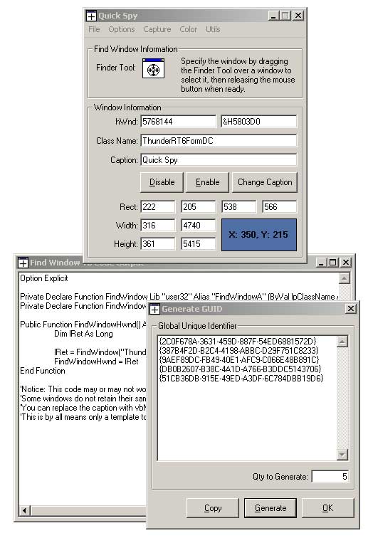

## Quick Spy

### Description

A sort of programmer's tool, just look at the screen shot. It deals mostly with windows hWnds, and has a few more utils built in. I added a nice screenshot/capture utility to have handy and also a code generator for outputting the code needed to find a window. Download and look, it's worth it. Wrote it mostly as a tool for myself, but I am sure it will come in handy for others, so here ya go.
 
### More Info
 

             |
---                |---
**Submitted On**   |2001-05-16 22:11:12
**By**             |[Shannon Harmon](https://github.com/Planet-Source-Code/PSCIndex/blob/master/ByAuthor/shannon-harmon.md)
**Level**          |Intermediate
**User Rating**    |4.6 (32 globes from 7 users)
**Compatibility**  |VB 6\.0
**Category**       |[Complete Applications](https://github.com/Planet-Source-Code/PSCIndex/blob/master/ByCategory/complete-applications__1-27.md)
**World**          |[Visual Basic](https://github.com/Planet-Source-Code/PSCIndex/blob/master/ByWorld/visual-basic.md)
**Archive File**   |[Quick Spy196755162001\.zip](https://github.com/Planet-Source-Code/shannon-harmon-quick-spy__1-23220/archive/master.zip)

